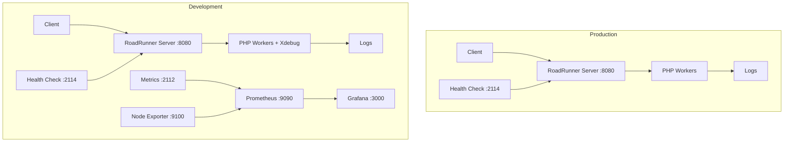
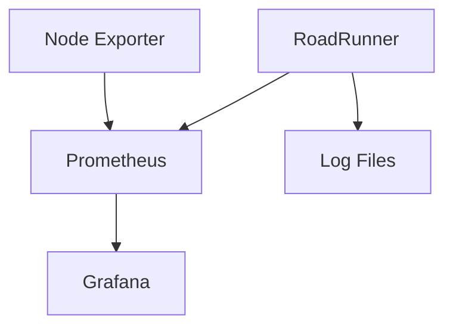

# DevOps Documentation

## Environment Overview

This document describes the infrastructure and development setup for the Willhaben VIP Redirect Service.

### Technology Stack

- **Application Server**: RoadRunner PHP Application Server
- **Container Runtime**: Docker & Docker Compose
- **Monitoring**: Prometheus, Grafana, Node Exporter
- **Development Tools**: Xdebug, Live Reload
- **Logging**: JSON-formatted logs with centralized collection

## Quick Reference

### Common Commands
```bash
# Start Production
./docker/manage.sh build
./docker/manage.sh start

# Start Development with Monitoring
ENV=development ./docker/manage.sh build
ENV=development ./docker/manage.sh start

# View Logs
./docker/manage.sh logs roadrunner    # RoadRunner logs
./docker/manage.sh logs prometheus    # Prometheus logs
./docker/manage.sh logs grafana      # Grafana logs

# Quick Restart
./docker/manage.sh restart

# Clean Environment
./docker/manage.sh clean
```

### Important URLs

Production:
- Application: http://localhost:8080
- Health Check: http://localhost:2114

Development:
- Application: http://localhost:8080
- Health Check: http://localhost:2114
- Metrics: http://localhost:2112
- Prometheus: http://localhost:9090
- Grafana: http://localhost:3000 (admin/secret)
- Node Exporter: http://localhost:9100

### Log File Locations
```plaintext
public/logs/
├── redirect.log       # Application redirects
├── roadrunner.log    # RoadRunner server logs
├── php_error.log     # PHP errors
└── xdebug.log        # Debug logs (dev only)
```

### Resource Limits

Production:
- CPU: 1 core (min 0.25)
- Memory: 512MB (min 128MB)

Development:
- CPU: 2 cores (min 0.5)
- Memory: 1GB (min 256MB)

### Default Ports
| Service     | Production | Development |
|-------------|------------|-------------|
| Application | 8080       | 8080        |
| Health      | 2114       | 2114        |
| Metrics     | -          | 2112        |
| Prometheus  | -          | 9090        |
| Grafana     | -          | 3000        |
| Node Export | -          | 9100        |
| Xdebug      | -          | 9003        |

## Architecture Diagram



## Version Control Strategy

### Branch Structure
- `main`: Production-ready code
- `develop`: Development branch
- `feature/*`: Feature branches
- `hotfix/*`: Emergency fixes

### Commit Guidelines
- Use semantic commit messages
- Include issue/ticket references
- Sign commits with GPG

### Release Process
1. Feature development in feature branches
2. Merge to develop with PR review
3. Release testing in develop
4. Merge to main for production
5. Tag releases with semantic versioning

## CI/CD Pipeline

### Continuous Integration
```yaml
stages:
  - lint
  - test
  - build
  - deploy

lint:
  script:
    - composer install
    - php-cs-fixer fix --dry-run
    - phpstan analyse

test:
  script:
    - composer install
    - phpunit

build:
  script:
    - docker build -t willhaben-redirect:${CI_COMMIT_SHA} .
    - docker push willhaben-redirect:${CI_COMMIT_SHA}

deploy:
  script:
    - docker-compose pull
    - docker-compose up -d
```

### Development Pipeline
1. Code Push → Automated Tests
2. PR Creation → Code Review
3. Merge → Development Deploy
4. Release → Production Deploy

### Production Pipeline
1. Main Branch Update
2. Build Production Image
3. Run Security Scans
4. Deploy to Staging
5. Run Integration Tests
6. Deploy to Production

### Deployment Environments
- Local Development
- CI Testing
- Staging
- Production

### Rollback Procedures
```bash
# Revert to previous version
git checkout <previous-tag>
./docker/manage.sh build
./docker/manage.sh clean
./docker/manage.sh start

# Monitor logs for issues
./docker/manage.sh logs roadrunner
```

## Environments

### Production Environment

```yaml
Stack Components:
- RoadRunner Server
  - Port: 8080 (Application)
  - Port: 2114 (Health Check)
Resource Limits:
  - CPU: 1 core
  - Memory: 512MB
```

### Development Environment

```yaml
Stack Components:
- RoadRunner Server (Debug Mode)
  - Port: 8080 (Application)
  - Port: 2114 (Health Check)
  - Port: 2112 (Metrics)
  - Port: 9003 (Xdebug)
- Prometheus
  - Port: 9090
- Grafana
  - Port: 3000
- Node Exporter
  - Port: 9100
Resource Limits:
  - CPU: 2 cores
  - Memory: 1GB
```

## Container Configuration

### Production Container

```dockerfile
Base Image: php:8.4-cli
Extensions:
- opcache
Environment:
- APP_ENV=production
- ERROR_REPORTING=32767
Volumes:
- ./public:/app/public
- ./vendor:/app/vendor
```

### Development Container

```dockerfile
Base Image: php:8.4-cli
Extensions:
- opcache
- xdebug
Environment:
- APP_ENV=development
- XDEBUG_MODE=develop,debug
- PHP_IDE_CONFIG=serverName=roadrunner
Volumes:
- .:/app
```

## Monitoring Setup

### Prometheus Configuration

- Scrape Interval: 15s
- Metrics Collection:
  * HTTP request duration
  * Request/Response sizes
  * PHP worker memory usage
  * System metrics via Node Exporter

### Grafana Dashboards

1. RoadRunner Performance Dashboard
   - Request rate and latency
   - Worker pool statistics
   - Memory usage trends

2. System Metrics Dashboard
   - CPU utilization
   - Memory consumption
   - Disk I/O
   - Network statistics

## Development Workflow

### Local Development

1. Start development environment:
   ```bash
   ENV=development ./docker/manage.sh start
   ```

2. Access development tools:
   - Application: http://localhost:8080
   - Grafana: http://localhost:3000
   - Prometheus: http://localhost:9090

3. Debugging:
   - Configure IDE for Xdebug (Port 9003)
   - Set breakpoints in PHP code
   - Use debug log in public/logs/xdebug.log

### Code Deployment

1. Build production image:
   ```bash
   ./docker/manage.sh build
   ```

2. Start production services:
   ```bash
   ./docker/manage.sh start
   ```

## Performance Tuning

### PHP Configuration

Production:
```ini
opcache.enable=1
opcache.jit=1255
opcache.memory_consumption=256
memory_limit=256M
```

Development:
```ini
opcache.enable=1
opcache.validate_timestamps=1
xdebug.mode=develop,debug
memory_limit=512M
```

### RoadRunner Configuration

Production:
```yaml
pool:
  num_workers: 4
  max_jobs: 10
  supervisor:
    exec_ttl: 60s
```

Development:
```yaml
pool:
  debug: true
  num_workers: 2
  max_jobs: 0
```

## Log Management

### Log Locations

```plaintext
/app/public/logs/
├── redirect.log       # Application logs
├── roadrunner.log    # Server logs
├── php_error.log     # PHP errors
└── xdebug.log        # Debug logs
```

### Log Rotation

```yaml
logging:
  driver: "json-file"
  options:
    max-size: "50m"
    max-file: "5"
```

## Health Checks

- Endpoint: http://localhost:2114
- Check Interval: 30s (Production), 10s (Development)
- Failure Threshold: 3 attempts
- Timeout: 10s (Production), 5s (Development)

## Resource Management

### Production Limits

```yaml
deploy:
  resources:
    limits:
      cpus: '1'
      memory: 512M
    reservations:
      cpus: '0.25'
      memory: 128M
```

### Development Limits

```yaml
deploy:
  resources:
    limits:
      cpus: '2'
      memory: 1G
    reservations:
      cpus: '0.5'
      memory: 256M
```

## Scaling Considerations

- Horizontal scaling via Docker Compose
- Load balancing through external proxy
- Metrics-based auto-scaling capability
- Session handling considerations

## Alerting and Monitoring

### Alert Thresholds

#### System Alerts
```yaml
CPU Usage:
  warning: 70%
  critical: 85%
Memory Usage:
  warning: 75%
  critical: 90%
Disk Space:
  warning: 80%
  critical: 90%
```

#### Application Alerts
```yaml
Response Time:
  warning: >500ms
  critical: >1s
Error Rate:
  warning: >1% of requests
  critical: >5% of requests
Worker Memory:
  warning: >200MB per worker
  critical: >300MB per worker
```

#### Health Check Alerts
```yaml
Health Check:
  interval: 30s
  failure_threshold: 3
  alert_on: consecutive_failures
Recovery:
  auto_restart: true
  max_restarts: 3
```

### Prometheus Alert Rules

```yaml
groups:
- name: roadrunner_alerts
  rules:
  - alert: HighErrorRate
    expr: rate(http_request_errors_total[5m]) / rate(http_requests_total[5m]) > 0.05
    for: 5m
    labels:
      severity: critical
    annotations:
      summary: High error rate detected
      description: Error rate is above 5% for the last 5 minutes

  - alert: SlowResponses
    expr: rate(http_request_duration_seconds_sum[5m]) / rate(http_request_duration_seconds_count[5m]) > 1
    for: 5m
    labels:
      severity: warning
    annotations:
      summary: Slow response times detected
      description: Average response time is above 1 second for the last 5 minutes

  - alert: HighMemoryUsage
    expr: container_memory_usage_bytes{container="roadrunner"} > 1073741824
    for: 5m
    labels:
      severity: warning
    annotations:
      summary: High memory usage detected
      description: Container memory usage is above 1GB
```

### Alert Notifications

#### Development Environment
- Log to console
- Development team Slack channel
- Email notifications (optional)

#### Production Environment
- Production Slack channel
- Email notifications
- SMS for critical alerts
- PagerDuty integration

### Alert Response Procedures

1. Immediate Actions:
   ```bash
   # Check system status
   ./docker/manage.sh status
   
   # View recent logs
   ./docker/manage.sh logs roadrunner --tail 100
   
   # Check metrics
   curl http://localhost:2112/metrics
   ```

2. Investigation:
   - Review Grafana dashboards
   - Check PHP error logs
   - Analyze system metrics
   - Review recent changes

3. Resolution:
   - Scale resources if needed
   - Restart services if required
   - Apply hotfixes if necessary
   - Update alert thresholds if false positive

### Alert Management

#### Silencing Alerts
```yaml
# Silence during maintenance
silence_alert:
  name: "maintenance_window"
  start_time: "YYYY-MM-DD HH:MM:SS"
  end_time: "YYYY-MM-DD HH:MM:SS"
  alert_names:
    - HighErrorRate
    - SlowResponses
```

#### Alert History
- Keep alert history for 30 days
- Weekly alert review
- Monthly threshold adjustments
- Quarterly policy review

## Service Dependencies

### Startup Order


### Service Relationships

```yaml
Primary Services:
  roadrunner:
    depends_on: []
    required: true
    startup_order: 1

Monitoring Services:
  node-exporter:
    depends_on: []
    required: false
    startup_order: 1
  
  prometheus:
    depends_on: 
      - node-exporter 
      - roadrunner
    required: false
    startup_order: 2
  
  grafana:
    depends_on: 
      - prometheus
    required: false
    startup_order: 3

Volumes:
  prometheus_data:
    required_by: 
      - prometheus
    backup: true
  
  grafana_data:
    required_by:
      - grafana
    backup: true
```

### Dependency Management

1. Startup Dependencies:
   ```yaml
   # docker-compose.dev.yml
   services:
     roadrunner:
       healthcheck:
         test: ["CMD", "curl", "-f", "http://localhost:2114"]
         interval: 10s
         timeout: 5s
         retries: 3
         start_period: 10s

     prometheus:
       depends_on:
         node-exporter:
           condition: service_started
         roadrunner:
           condition: service_healthy

     grafana:
       depends_on:
         prometheus:
           condition: service_started
   ```

2. Service Health Checks:
   - RoadRunner: HTTP endpoint (:2114)
   - Prometheus: HTTP endpoint (:9090/-/healthy)
   - Grafana: HTTP endpoint (:3000/api/health)
   - Node Exporter: TCP port check (:9100)

3. Recovery Order:
   ```bash
   # Proper shutdown order
   docker-compose stop grafana prometheus node-exporter roadrunner

   # Proper startup order
   docker-compose start roadrunner node-exporter prometheus grafana
   ```

4. Volume Management:
   ```bash
   # Backup volumes before updates
   docker run --rm \
     -v prometheus_data:/source/prometheus \
     -v grafana_data:/source/grafana \
     -v $(pwd)/backups:/backup \
     alpine tar czf /backup/monitoring_data.tar.gz /source

   # Restore volumes if needed
   docker run --rm \
     -v prometheus_data:/dest/prometheus \
     -v grafana_data:/dest/grafana \
     -v $(pwd)/backups:/backup \
     alpine tar xzf /backup/monitoring_data.tar.gz -C /dest
   ```

## Security Measures

1. Network Security:
   - Internal services not exposed
   - Health check endpoints protected
   - Metrics access restricted

2. Container Security:
   - Non-root user execution
   - Read-only file system where possible
   - Limited capabilities

3. Development Security:
   - Debug tools only in development
   - Secure default configurations
   - Environment-specific settings

## Backup and Recovery

1. Data Persistence:
   - Docker volumes for critical data
   - Log file persistence
   - Metrics data retention

2. Recovery Procedures:
   ```bash
   # Stop services
   ./docker/manage.sh stop

   # Clean up
   ./docker/manage.sh clean

   # Rebuild and restart
   ./docker/manage.sh build
   ./docker/manage.sh start
   ```

## Troubleshooting Guide

### Common Issues

1. Container Startup Failures:
   ```bash
   # Check logs
   ./docker/manage.sh logs roadrunner
   ```

2. Performance Issues:
   - Check Grafana dashboards
   - Review PHP worker metrics
   - Monitor system resources

3. Development Environment:
   - Verify Xdebug connection
   - Check file permissions
   - Review PHP configuration

### RoadRunner Specific Issues

```yaml
Common Problems and Solutions:

1. Worker Pool Not Starting:
   Problem: Workers fail to start or die immediately
   Solutions:
   - Check PHP binary path in .rr.yaml
   - Verify PHP extensions are loaded
   - Check worker memory limits
   Command:
   ```bash
   ./docker/manage.sh logs roadrunner | grep "worker"
   ```

2. Static File Serving Issues:
   Problem: Static files not being served
   Solutions:
   - Verify file permissions
   - Check static file configuration in .rr.yaml
   - Ensure files are in the correct directory
   Command:
   ```bash
   curl -I http://localhost:8080/path/to/static/file
   ```

3. PHP Process Crashes:
   Problem: PHP workers crash unexpectedly
   Solutions:
   - Increase worker memory limit
   - Check PHP error logs
   - Verify OPcache settings
   Command:
   ```bash
   ./docker/manage.sh logs roadrunner --tail 100 | grep "error"
   ```

4. Performance Degradation:
   Problem: Slow response times
   Solutions:
   - Adjust worker pool size
   - Check PHP-FPM settings
   - Monitor memory usage
   Command:
   ```bash
   curl -w "%{time_total}\n" -s http://localhost:8080/
   ```

5. Memory Leaks:
   Problem: Memory usage grows over time
   Solutions:
   - Set max_jobs per worker
   - Enable worker reload after N requests
   - Monitor worker memory usage
   Command:
   ```bash
   docker stats roadrunner
   ```

Quick Recovery Commands:
```bash
# Restart worker pool
docker-compose exec roadrunner rr reset

# Check RoadRunner status
docker-compose exec roadrunner rr status

# View worker state
docker-compose exec roadrunner rr workers -i

# Reset metrics
docker-compose exec roadrunner rr reset-metrics
```

## Maintenance Procedures

### Regular Maintenance

1. Log Rotation:
   - Automated via Docker logging configuration
   - Regular disk space monitoring

2. Updates:
   ```bash
   # Update images
   docker-compose pull
   
   # Rebuild services
   ./docker/manage.sh build
   ```

3. Health Checks:
   - Monitor health check endpoint
   - Review error logs
   - Check metrics dashboards

### Emergency Procedures

1. Service Recovery:
   ```bash
   # Quick restart
   ./docker/manage.sh restart

   # Full recovery
   ./docker/manage.sh clean
   ./docker/manage.sh build
   ./docker/manage.sh start
   ```

2. Debug Mode:
   ```bash
   # Start with debug logging
   ENV=development ./docker/manage.sh start
   ```

